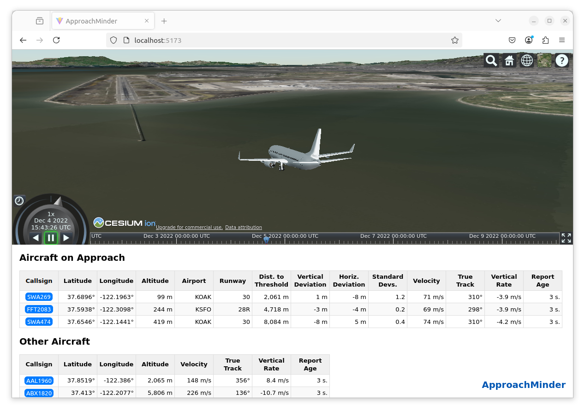
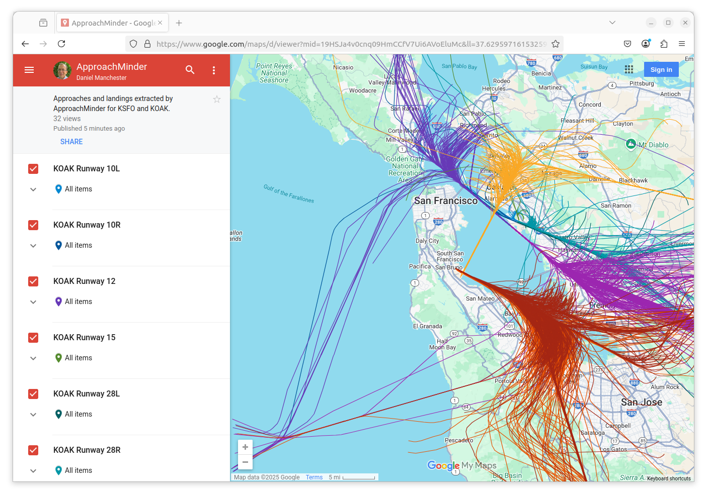
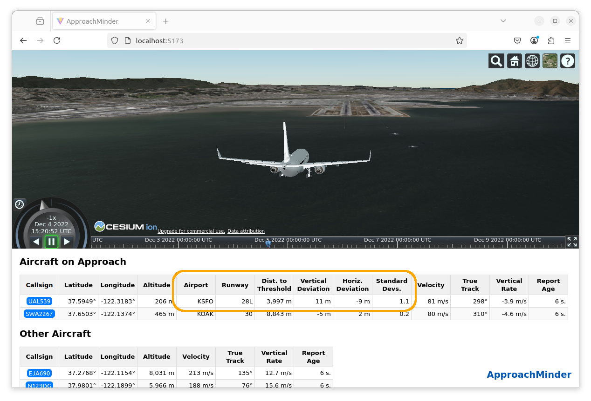

# ApproachMinder

ApproachMinder is a proof of concept for **detecting incorrectly flown aircraft approaches** in real time using [ADS-B](https://skybrary.aero/articles/automatic-dependent-surveillance-broadcast-ads-b) data.

Created by [Daniel Manchester](https://www.dmanchester.com/), ApproachMinder is still under development, and its code has not been refined, but the initial results are encouraging.

## Motivation

Incorrectly flown aircraft approaches are an ongoing problem in aviation. Under such an approach, a pilot seeking to land an aircraft deviates excessively from the intended runway's approach path.

**Incorrectly flown approaches can be deadly.** On 6 July 2013, while attempting to land at San Francisco International Airport, **Asiana Airlines Flight 214** descended too far as it neared Runway 28L. It struck the airport's seawall and crashed, killing three passengers and injuring many on board. ([NTSB report](https://www.ntsb.gov/investigations/accidentreports/reports/aar1401.pdf); [SKYbrary article](https://skybrary.aero/accidents-and-incidents/b772-san-francisco-ca-usa-2013))

Four years later, on 7 July 2017, a far larger tragedy was narrowly averted at the same airport. Intending to land on Runway 28R, **Air Canada Flight 759** instead lined up with a neighboring taxiway. Four aircraft loaded with passengers and fuel were positioned on the taxiway, awaiting their opportunity to take off. In the final moments before likely impact with the waiting aircraft, the Air Canada crew realized their mistake and aborted the landing attempt. ([NTSB report](https://www.ntsb.gov/investigations/accidentreports/reports/air1801.pdf); [SKYbrary article](https://skybrary.aero/accidents-and-incidents/a320-b789-a343-san-francisco-ca-usa-2017))

Incorrectly flown approaches are not unique to airports in the United States. On 23 May 2022, an **Airhub Airlines flight** sought to land in low-visibility conditions at Paris's Charles de Gaulle Airport. Due to an incorrectly set altimeter, the pilot descended excessively on approach. While still nearly one nautical mile from the runway, the pilot flew within 6 feet of the ground before aborting the landing attempt. ([BEA report](https://bea.aero/fileadmin/uploads/9HEMU/9H-EMU_EN.pdf); [SKYbrary article](https://skybrary.aero/accidents-and-incidents/a320-vicinity-paris-cdg-france-2022))

These incidents all relate to modern aircraft operating commercial flights to major airports. There have been other such incidents. And if one also considers [general aviation](https://skybrary.aero/articles/general-aviation-ga) flights, smaller airports, and less-advanced aircraft, **the problem of incorrectly flown approaches likely runs much deeper.**

## Concept

The wide availability of [ADS-B](https://skybrary.aero/articles/automatic-dependent-surveillance-broadcast-ads-b) data has opened new avenues for reducing the incidence of incorrectly flown aircraft approaches.

With ADS-B (Automatic Dependent Surveillance - Broadcast), aircraft continually broadcast their positions as determined by GPS (or other [GNSS](https://skybrary.aero/articles/global-navigation-satellite-system-gnss)).

**The ApproachMinder concept applies ADS-B to the problem of incorrectly flown approaches via a three-point strategy:**
1. Extract approaches and landings from historical ADS-B data.
2. Train runway-specific statistical models from those approaches and landings.
3. In real time, monitor the "live" ADS-B data from aircraft. Using the models from \#2, infer when an aircraft is on approach and its intended airport and runway, quantify its deviation from the applicable model, and raise an alert on excessive deviation.

Various stores of historical ADS-B data exist, as do multiple networks for collecting live data. Accordingly, **applying the ApproachMinder concept to an airport would not involve installing or operating additional equipment at that airport. The real-time monitoring and alerting could occur centrally.**

## Status

As mentioned above, ApproachMinder is still under development, and the underlying software has not been refined. However, **development has progressed far enough to have produced encouraging initial results.**

For point #1 of the concept (extracting approaches and landings from historical ADS-B data), using [OpenSky Network](https://opensky-network.org/) ADS-B data from the San Francisco Bay area, as well as readily available geospatial information about the runways at San Francisco International Airport (KSFO) and Oakland International Airport (KOAK), **ApproachMinder was able to extract approaches and landings for the airports' runways ([live map](https://www.google.com/maps/d/viewer?mid=19HSJa4v0cnq09HmCCfV7Ui6AVoEluMc&usp=sharing)):**

The following still frame from the ApproachMinder visualization provides a perspective on the implementation of point #2 (training statistical models) and point #3 (inferring which aircraft are on approach and their intended runways; quantifying deviation from the models):

The still frame shows the result of analyzing ADS-B data from 4 December 2022. (In a strict sense, the data was not "live": it was loaded from a file. However, it was judged to be a suitable approximation of live data, as it was gathered after the data that underpins the approach models used. Also, the ApproachMinder analysis for a given point in time did not access future data.)

The aircraft shown is United Airlines Flight 539 (UAL539). As highlighted in orange on the dashboard, **ApproachMinder examined the aircraft's trajectory against ApproachMinder's statistical models and correctly inferred that the aircraft is on approach to Runway 28L at KSFO.**

Further, **ApproachMinder calculated that:**

* 3,997 meters remain to the runway's threshold;
* UAL539's current position deviates 11 meters vertically and 9 meters horizontally from a statistical mean of historical aircraft positions at that point in the approach; and
* the combined vertical and horizontal deviation is 1.1 [standard deviations](https://en.wikipedia.org/wiki/Standard_deviation) from that historical mean.

Standard deviation values put an aircraft's meters-based deviations in context. For example, early in an approach, a vertical deviation of 100 meters and a horizontal one of 50 meters could be acceptable and statistically common, and would thus lead to a small standard deviation. But that same magnitude of vertical and horizontal deviation late in an approach could signal a serious problem and be statistically rare, leading to a large standard deviation.

ApproachMinder does not yet support alerts, but standard deviation values will likely be at their core: **If the standard deviation calculated for an aircraft's approach and position exceeds some threshold, ApproachMinder will raise an alert.**

## Technical Architecture

ApproachMinder consists of **analysis** and **visualization** components.

### Analysis Component
ApproachMinder's analysis component is written in [Scala](https://www.scala-lang.org/). It relies on various libraries in Scala and Java, employing them as follows:
* **[Play JSON](https://www.playframework.com/documentation/2.9.x/ScalaJson#The-Play-JSON-library):** Parse JSON-based ADS-B reports from the OpenSky Network. Produce JSON for the visualization component.
* **[GeoTools](https://geotools.org/):** Convert latitude and longitude positions to the meters-based [Universal Transverse Mercator](https://en.wikipedia.org/wiki/Universal_Transverse_Mercator_coordinate_system) (UTM) projection.
* **[JTS Topology Suite](https://github.com/locationtech/jts?tab=readme-ov-file#jts-topology-suite):** Perform calculations on UTM coordinates.
* **[Apache Commons Math](https://commons.apache.org/proper/commons-math/):** Calculate statistics.
* **[specs2](https://etorreborre.github.io/specs2/):** Automated testing.

### Visualization Component
ApproachMinder's visualization component is written in JavaScript. It employs libraries as follows:
* **[CesiumJS](https://cesium.com/platform/cesiumjs/):** Provide in-browser, three-dimensional visualizations of aircraft in flight. Offer various controls to the user, including a time slider.
* **[Svelte](https://svelte.dev/):** Display a dashboard pane of aircraft data, keeping it synchronized with the clock time as managed by CesiumJS. Offer clickable callsigns for tracking aircraft.
* **[Jasmine](https://jasmine.github.io/):** Automated testing.

## Future Development

The following future ApproachMinder development is anticipated.

### More-Advanced Approach Models

ApproachMinder's current models support approaches beyond the simple, straight-in variety. However, they do not account well for distinct flows of aircraft before those flows converge for a given runway.

For example, referring to [this approach chart](https://aeronav.faa.gov/d-tpp/2502/00375I28RSAC1.PDF) for KSFO Runway 28R, ApproachMinder can accurately model the approach from waypoint CEPIN onward. But ApproachMinder does not handle well the fact that aircraft may arrive at CEPIN from either of two sub-approaches. (It calculates a mean path that lies between the sub-approaches that is likely flown by few aircraft, if any.)

A future version of ApproachMinder will rely on clustering logic to discern sub-approaches and will model them as a tree-like structure.

### Visualization of Approach Models

While the ApproachMinder visualization shows numerical results derived from approach models, it does not show the models themselves.

  A future version will display the models. The display will likely rely on a "crosshairs" metaphor, with vertical crosshairs placed at distance intervals leading to a runway threshold. Each crosshairs would be centered on the mean position a model has calculated from historical data for that distance, and crosshair markings would show the associated standard deviations.

### Alerting

As discussed above, ApproachMinder does not yet support alerts.

A future version will add them. If an aircraft deviates excessively from its inferred approach, ApproachMinder will show a warning within the visualization, even if the user hadn't previously been monitoring the aircraft's descent.

### Support for AIXM Data

Geospatial information about an airport's runways—their width; the coordinates of their thresholds' centers—must currently be input manually.

A future version of ApproachMinder will source that data from XML-based [AIXM](https://aixm.aero/) files; in the case of the United States, files from the [NASR data](https://www.faa.gov/air_traffic/flight_info/aeronav/aero_data/NASR_Subscription/) of the Federal Aviation Administration (FAA).

Initial development against FAA AIXM data with the [xml-spac](https://github.com/dylemma/xml-spac) parser has been successful.

### TypeScript Migration

A future version of ApproachMinder will migrate the visualization component to [TypeScript](https://www.typescriptlang.org/).

## Attributions

"[B737-800 Model](https://skfb.ly/oSG9Q)", the 3D model used in the still frames, was created by [hikami3150](https://sketchfab.com/hikami3150) and is licensed under the [Creative Commons Attribution](http://creativecommons.org/licenses/by/4.0/) license.